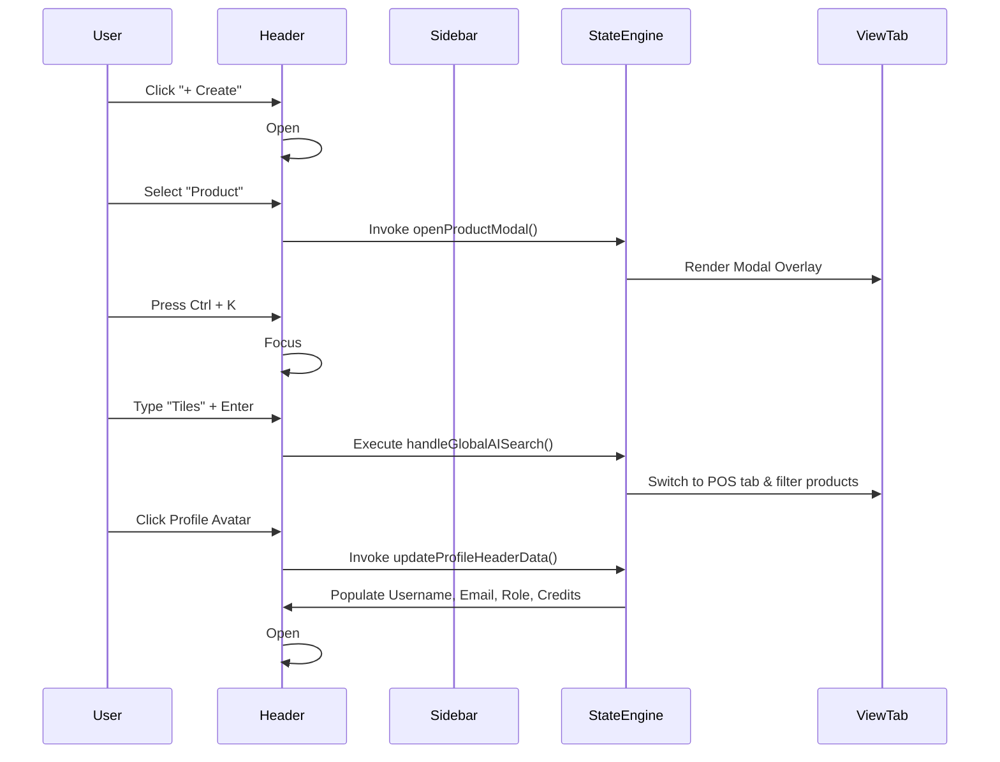

# 🏗️ Header & Sidebar Architecture Document

This document provides a comprehensive structural, behavioral, and technical architectural overview of the **Compact Global Header** and **Sidebar System** in the **Inventia POS Application**.

---

## 1. High-Level Architectural Layout

The application shell uses a modern two-axis flexbox/grid layout where the **Compact Global Header** remains sticky at the top, and the **Sidebar Navigation** controls the view rendering inside the **Main Content Area**.

```
┌──────────────────────────────────────────────────────────────────────────────────────────────────────────────────────────────┐
│                                                 COMPACT GLOBAL HEADER                                                        │
│ ☰ Logo | + Create ▼ | 🔍 AI Search...                                          🔔 Notifications ▼ | 👤 Profile ▼             │ 
├───────────────────────┬──────────────────────────────────────────────────────────────────────────────────────────────────────┤
│        SIDEBAR        │                                             MAIN CONTENT                                             │
│ 📊 Dashboard          │ ┌──────────────────────────────────────────────────────────────────────────────────────────────────┐ │
│ 🛒 Point of Sale      │ │                                            TAB PANELS                                            │ │
│ 📦 Inventory          │ │  • Dashboard Overview  • POS Checkout  • Stock Manager  • Transactions  • Settings               │ │
│ 📄 Transactions       │ └──────────────────────────────────────────────────────────────────────────────────────────────────┘ │
│ 👥 CRM & Customers    │                                                                                                      │
│ 👔 Staff & Roles      │                                                                                                      │
│ 📈 Analytics          │                                                                                                      │
│ ⚙️ Settings           │                                                                                                      │
└───────────────────────┴──────────────────────────────────────────────────────────────────────────────────────────────────────┘
```

---

## 2. Header Architecture Breakdown

The header component (`<header class="header-bar compact-global-header">`) is structured into two main flex containers:

### A. Header Left Group (`.header-left-group`)

```
[ ☰ Sidebar Toggle ] -> [ ⚡ Logo & Brand ] -> [ + Create ▼ ] -> [ 🔍 AI Search... (Ctrl+K) ]
```

1. **Sidebar Toggle (`#sidebarToggleBtn`)**:
   * **Function**: Executes `toggleSidebarMenu()`.
   * **Behavior**: Toggles `.collapsed` on `<aside class="sidebar">` and `.expanded` on `<main class="main-content">`.
2. **Brand Logo (`.header-brand-logo`)**:
   * **Function**: Executes `switchTab('dashboard')`.
   * Displays the electric brand icon, brand title, and `POS` badge.
3. **Direct-Create Menu (`#createMenuWrapper`)**:
   * **Trigger**: `toggleCreateMenu(event)` toggles `#createMenuDropdown`.
   * **Search Filter**: Input `#createMenuFilterInput` executes `filterCreateMenuOptions()` in real-time.
   * **16 Creation Actions**:
     | Category | Action Items | Handler Function |
     | :--- | :--- | :--- |
     | **Sales & Billing** | Invoice, Pro Forma Invoice, Quotation | `switchTab('pos')` |
     | **Purchases & Stock** | Purchase Invoice, Purchase Order, Delivery Challan, Purchase Return, Stock In | `switchTab('inventory')` |
     | **Orders & Returns** | Sales Order, Sales Return | `switchTab('sales')` |
     | **Finance** | Expense, Pay Out | `switchTab('reports')` |
     | **Entities** | Customer, Pay In | `openCustomerModal()` |
     | **Catalog & Vendors** | Vendor (`switchTab('crm')`), Product (`openProductModal()`) | Dynamic Handler |

4. **Global AI Search Input (`.header-ai-search-box`)**:
   * **HotKey**: Global `keydown` event listener intercepts **`Ctrl + K`** to focus `#globalAISearchInput`.
   * **Action**: On `Enter`, triggers `handleGlobalAISearch(event)` to filter active products or open the AI assistant drawer.

---

### B. Header Right Group (`.header-right-group`)

```
[ 🧮 Calculator ] -> [ 🔔 Notifications Feed ▼ ] -> [ 👤 Rich Profile Dropdown ▼ ]
```

1. **Area Calculator Tool (`.header-tool-btn`)**:
   * **Function**: Executes `toggleCalculatorModal()` to open the square-foot tile/flooring area calculator.

2. **3-Day Retention Notification Feed (`.notification-bell`)**:
   * **Retention Policy**: `systemNotifications` filter checks `Date.now() - timestamp < 3 Days (259,200,000 ms)`.
   * **Unread Counter Badge**: `#notificationBadge` dynamically updates and shows/hides.
   * **Category Filter Pills**:
     * `All`: Displays full audit log.
     * `Sales`: Filters sales & payment events.
     * `Stock`: Filters stock alerts & product changes.
     * `Dues`: Filters invoice due dates & reminders.
   * **Footer Actions**:
     * `Mark All As Read`: Executes `markAllNotificationsAsRead(event)`.
     * `View All Notifications →`: Executes `viewAllNotifications()`.

3. **Rich Profile Dropdown Menu (`.header-profile-trigger`)**:
   * **Trigger**: `toggleProfileDropdown(event)` opens `#profileDropdown`.
   * **Card Header Section**:
     * User Avatar (`#menuHeaderAvatar`), Full Name (`#menuHeaderName`), Email (`#menuHeaderEmail`), Phone (`#menuHeaderPhone`), Role Badge (`#menuHeaderRole`), and Credits Badge (`500 Credits`).
   * **Promotions**:
     * `Get 50% Off Premium` -> `openPremiumOfferModal()`
     * `Check Premium Plans` -> `openSubscriptionModal()`
   * **Utilities & Preferences**:
     * `Daily Mode` -> `toggleThemeMode()` (toggles Light/Dark theme mode & saves to `localStorage`).
     * `Keyboard Shortcuts` -> `openKeyboardShortcutsModal()` (Hotkeys list).
     * `Help & Support` -> `openHelpSupportModal()`.
     * `Settings` -> `switchTab('settings-tab')`.
   * **Referrals & Auth**:
     * `Refer & Earn` -> `openReferralModal()`.
     * `Logout` -> `logout()`.
   * **Mobile App Footer**:
     * `Play Store App` -> `openAppDownloadModal()` (displays Android app QR code).

---

## 3. Sidebar Architecture & Security Scoping

The Sidebar Navigation (`<aside class="sidebar">`) manages view state and enforces **Role-Based Access Control (RBAC)**.

### Sidebar Structure

```html
<aside class="sidebar">
  <div class="sidebar-head">...</div>
  <nav class="sidebar-nav">
    <!-- Main Group -->
    <button data-tab="dashboard">Dashboard Overview</button>
    <button data-tab="pos">Point of Sale</button>
    <button data-tab="inventory">Inventory & Products</button>
    <button data-tab="sales">Sales & Transactions</button>
    
    <!-- Management Dropdowns -->
    <div id="dropdownCRM">CRM & Customers</div>
    <div id="dropdownTeam">Staff Directory & Roles</div>
    
    <!-- Tools -->
    <button data-tab="reports">Analytics & Reports</button>
    <button data-tab="settings-tab">System Settings</button>
  </nav>
</aside>
```

### Role Scoping Matrix

When a user logs in, `updateProfileUI()` evaluates `localStorage.getItem('role')` and dynamically scopes the sidebar menu items:

| Navigation Item | Admin | Manager | Cashier |
| :--- | :---: | :---: | :---: |
| **Dashboard** | ✅ Visible | ✅ Visible | ❌ Hidden |
| **Point of Sale (POS)** | ✅ Visible | ✅ Visible | ✅ Visible |
| **Inventory & Warehouses** | ✅ Visible | ✅ Visible | ❌ Hidden |
| **Sales Transactions** | ✅ Visible | ✅ Visible | ❌ Hidden |
| **CRM & Customers** | ✅ Visible | ✅ Visible | ✅ Visible |
| **Staff & Permissions** | ✅ Visible | ❌ Hidden | ❌ Hidden |
| **Analytics & Reports** | ✅ Visible | ✅ Visible | ❌ Hidden |
| **System Settings** | ✅ Visible | ❌ Hidden | ❌ Hidden |

---

## 4. State & Event Flow Diagram



---

## 5. CSS Tokens & Dark Mode Compatibility

The Header and Sidebar rely on central CSS custom properties defined in `public/style.css`:

```css
:root {
  --bg: #f8fafc;
  --bg-card: #ffffff;
  --border: #e2e8f0;
  --primary-color: #2563eb;
  --primary-color-light: #eff6ff;
  --ink: #0f172a;
  --ink-secondary: #475569;
  --ink-muted: #94a3b8;
}

/* Dark Mode Theme Overrides */
html[data-theme-mode="dark"] {
  --bg: #0f172a;
  --bg-card: #1e293b;
  --border: #334155;
  --ink: #f8fafc;
  --ink-secondary: #cbd5e1;
  --ink-muted: #64748b;
}
```

---

## 6. Hotkey Shortcut Registry

| Hotkey | Action Triggered | Handler |
| :--- | :--- | :--- |
| `Ctrl + K` | Focus AI Search input bar | `handleGlobalAISearch()` |
| `Alt + D` | Toggle Dark / Light Daily Mode | `toggleThemeMode()` |
| `Alt + C` | Open Area Calculator modal | `toggleCalculatorModal()` |
| `F2` | Switch directly to POS Checkout | `switchTab('pos')` |
| `F4` | Open Create Product modal | `openProductModal()` |
| `F8` | Open Add Customer modal | `openCustomerModal()` |
| `Ctrl + /` | Open Keyboard Shortcuts guide | `openKeyboardShortcutsModal()` |

---

*Document compiled and verified for Inventia POS v2.1 Architecture.*
